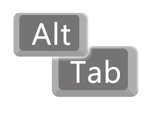

# edu-edit-lifecycle
A simple repository describing the edit lifecycle

## Grundläggande

> Som utvecklare är den dyraste rörelse vi gör när vi förflyttar handen från tangentbord till mus. Vi ska därför undvika att i bästa möjliga mån använda musen. 

> Innan du börjar, stänger du ned samtliga program, för att kunna koncentrera dig så bra som möjligt.

## Starta program

| Mac      | PC | LINUX |  
| ----------- | ----------- | ----------- |  
| Paragraph   | Text        |

## Byta program

| Mac      | PC | LINUX |  
| ----------- | ----------- | ----------- |  
|||Samma som PC/Mac|
